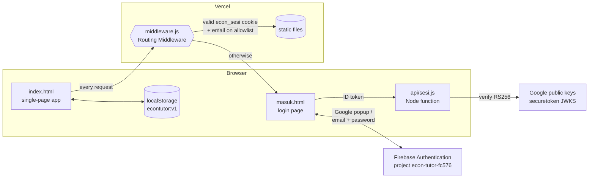
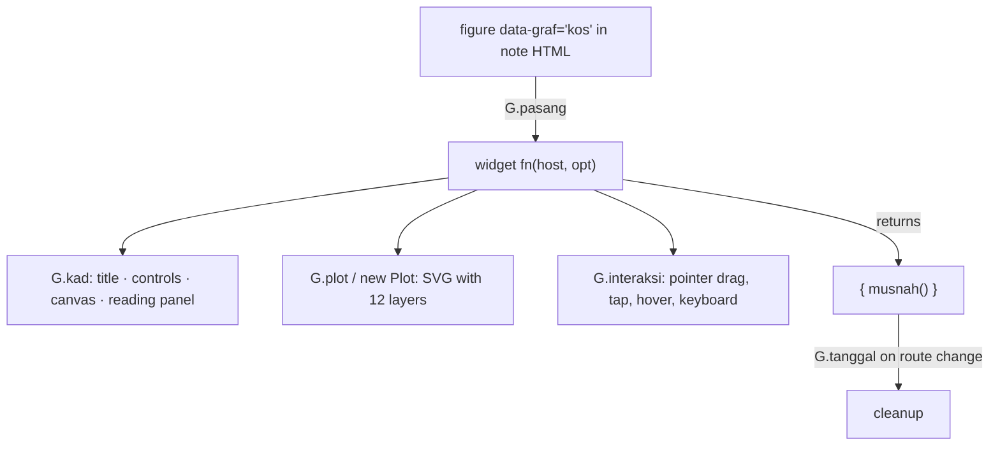
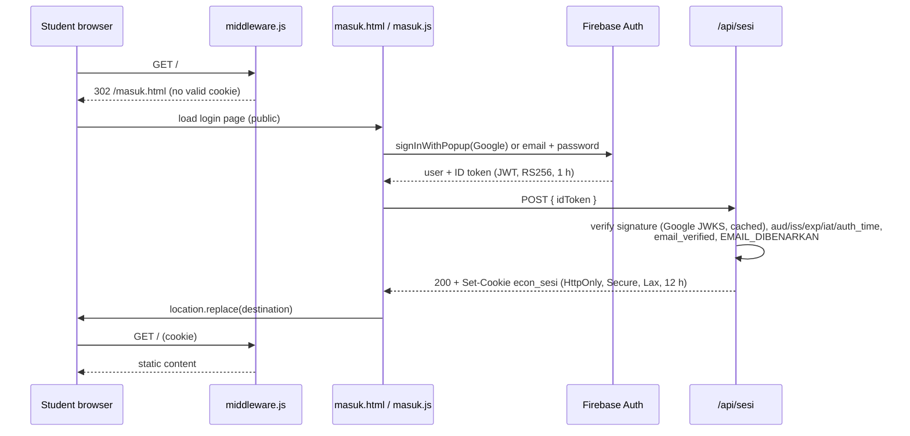
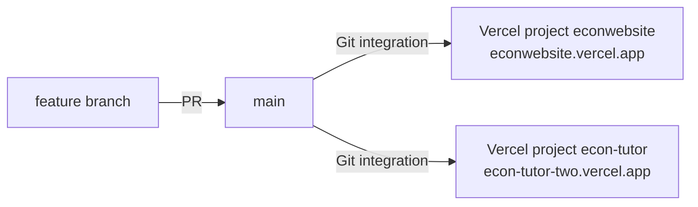

# Econ Tutor · Architecture

Econ Tutor is an interactive study site for **SPM Economics, Form 4 and Form 5 (KSSM)**. It is a static, build-free web app: plain HTML, CSS and ES5-style JavaScript in the browser, plus a small Vercel layer (Routing Middleware and one function) that puts all content behind a sign-in.

This document explains how the pieces fit together. For visual rules see [DESIGN_SYSTEM.md](DESIGN_SYSTEM.md). For product scope see [PRD.md](PRD.md). For contributor and AI-agent rules see [AGENTS.md](AGENTS.md).

---

## 1. System overview



| Layer | Technology | Responsibility |
| --- | --- | --- |
| Content app | `index.html` + `assets/js/*.js` (classic scripts, `defer`) | Notes, interactive graphs, flashcards, quizzes, trial papers |
| Styling | `assets/css/style.css` (one file, CSS custom properties) | Glass theme, light/dark, all components |
| Sign-in UI | `masuk.html` + `assets/js/masuk.js` (ES module) | Google or email/password sign-in via Firebase |
| Session API | `api/sesi.js` (Vercel Node function, Web `Request`/`Response`) | Verify Firebase ID token, check allowlist, issue/clear session cookie |
| Access gate | `middleware.js` (Vercel Routing Middleware, Edge) | Block every path except the login page and its assets unless the session is valid |
| Shared server lib | `lib/sesi.js`, `lib/token-firebase.js` | Signed cookie, allowlist parsing, Firebase token verification (Web Crypto, no dependencies) |
| Identity | Firebase Authentication (Spark/free) | Accounts, Google OAuth, email verification, password reset |
| Hosting | Vercel (Git integration on `main`) | Static files, middleware, function, env vars |

There is **no build step, no bundler and no runtime dependency** for the content app. `package.json` exists only to mark the server files as ES modules (`"type": "module"`).

---

## 2. Repository layout

```
index.html                    SPA shell (header, <main id="app">, footer, bottom nav, script tags)
masuk.html                    Login page (same theme, standalone)
middleware.js                 Vercel Routing Middleware: access gate
api/sesi.js                   POST/GET/DELETE /api/sesi
lib/sesi.js                   HMAC session cookie + allowlist (shared by middleware and API)
lib/token-firebase.js         Firebase ID-token verification with Google JWKS
package.json                  { "type": "module" } only, no dependencies
.vercelignore                 Keeps PDFs and the hidden Terengganu paper out of deployments

assets/css/style.css          Entire design system (tokens, components, graphs, login)
assets/favicon.svg
assets/js/eko-core.js         window.EKO: registries, storage, formatting, icons
assets/js/graf.js             EKO.graf: SVG plot engine + market graphs (demand, supply, equilibrium…)
assets/js/graf-t4.js          Form 4 graph widgets + chart helpers (G.carta, G.legenda…)
assets/js/graf-t5.js          Form 5 graph widgets
assets/js/data/t4-bab1.js …   One file per chapter: notes, flashcards, quiz
assets/js/data/percubaan-kelantan-2025.js     Trial paper K1 (40 MCQ) + K2 (7 questions, marking scheme)
assets/js/data/percubaan-seberang-perai-2025.js, percubaan-perak-2024.js   More trial papers (same shape)
assets/js/data/percubaan-terengganu-2025.js   Same shape; not loaded and not deployed (hidden)
assets/img/percubaan/<paper>/   Figures cropped from the original PDFs (WebP, 200 dpi)
assets/js/kalkulator.js       EKO.kalkulator: 39 formula calculators with worked steps + the #kalkulator view
assets/js/app.js              Router + all views
assets/js/akaun.js            Account button + sign-out in the header
assets/js/masuk.js            Login page logic (ES module)
assets/js/firebase-config.js  Public Firebase web config (ES module)
assets/js/vendor/firebase-auth-12.19.0.js     Self-hosted Firebase Auth SDK bundle (ESM)

*.pdf                         Source textbooks, teacher notes, exam papers (never deployed)
```

---

## 3. Front-end runtime

### 3.1 Script load order

`index.html` loads classic scripts with `defer`, so they execute in document order after parsing:

1. `eko-core.js` creates `window.EKO` (alias `E`).
2. `graf.js`, `graf-t4.js`, `graf-t5.js` attach `EKO.graf` (alias `G`) and register graph widgets.
3. `data/*.js` register chapters, quiz sets and Kertas 2 papers.
4. `kalkulator.js` defines the calculators and exposes `EKO.kalkulator`.
5. `app.js` builds navigation, reads the hash and renders the first view.
6. `akaun.js` asks `/api/sesi` who is signed in and adds the account button.

Every file is an IIFE that reads and extends `window.EKO`. No file uses `import`, except the login page scripts.

### 3.2 `EKO` core (`eko-core.js`)

| API | Purpose |
| --- | --- |
| `daftarBab(bab)` | Register a chapter; keeps `E.bab` sorted by form then number; indexes `E.babIkut[id]` |
| `daftarSet(set)` | Register an extra MCQ set (e.g. trial Kertas 1) in `E.setKuiz` |
| `daftarK2(paper)`, `kertas2Ikut(id)` | Register and look up Kertas 2 papers (`E.kertas2Set`) |
| `soalanBab(id)` | Chapter quiz = chapter questions + any trial-paper questions tagged `bab: id` |
| `kadBab(id)`, `babTingkatan(t)` | Flashcards with stable ids; chapters of a form |
| `data()`, `kemas(fn)`, `setSemula()` | Safe `localStorage` read, mutate-and-save, reset |
| `fmt`, `rm`, `peratus`, `bundar`, `clamp`, `lerp` | Number formatting in textbook style (`1 234.5`, `RM`, `−`) |
| `esc`, `kocok`, `kurangGerak`, `toast`, `ikon`, `tandaJenama` | HTML escaping, shuffle, reduced-motion check, toast, SVG icons, brand mark |

### 3.3 Router and views (`app.js`)

Routing is **hash-based** (`location.hash`), so the site works from `file://`, any static host, and behind the middleware without server routes.

| Hash | View function | Notes |
| --- | --- | --- |
| `#utama` (default) | `pUtama` | Hero, progress, continue reading, tools |
| `#nota` | `pNota` | Chapter grid by form |
| `#t4-b1` … `#t5-b2` | `pBab` | Chapter notes, sticky table of contents, "mark as read", next chapter |
| `#graf` | `pGraf` | "Makmal graf": every `<figure data-graf>` from all chapters, grouped |
| `#kad`, `#kad-<filter>` | `pKad` | Flashcards; filter `semua`, `t4`, `t5` or a chapter id; search; keyboard `Space`/`1`/`2`/`←`/`→` |
| `#kuiz` | `pKuizSenarai` | Quiz picker with best scores |
| `#kuiz-<id>` | `pKuizMula` | `id` = chapter id, `t4`, `t5`, `semua`, or a set id such as `kel25-k1`; timer, per-question explanation, review |
| `#percubaan` | `pPercubaan` | One section per registered paper (K1 + K2 cards) |
| `#kalkulator`, `#kalkulator-<filter>` | `EKO.kalkulator.papar` | Kalkulator Ekonomi. `<filter>` = `t4`, `t5` or a chapter id (filters the list), or a calculator id such as `ed` (scrolls to and highlights that card) |
| `#k2`, `#k2-<paperId>` | `pK2` | Kertas 2 with answer boxes, self-marking against the scheme, level rubrics |

`papar()` is the single render entry point. Before each render, `bersih()` tears down the previous view: it calls `G.tanggal()` (destroys graph widgets), disconnects the TOC observer, clears the quiz timer and removes view-level key listeners. After rendering, `G.pasang(app)` mounts any graph placeholders in the new HTML.

Views build HTML strings and assign `app.innerHTML`. Data values are passed through `E.esc` where they are plain text. Note HTML inside data files is trusted, authored content.

### 3.4 Graph engine (`EKO.graf`)

Graphs are hand-written SVG, which keeps the site dependency-free and allows economics-specific conventions such as axes from the origin, labels at the axis ends, and textbook letter labels.



- **Registry.** `G.daftar(name, fn, {tajuk, bab})` registers a widget, and `G.info` holds metadata. 31 widgets are used in the notes: 6 in `graf.js`, 12 in `graf-t4.js` and 13 in `graf-t5.js`.
- **Mounting.** `G.pasang(root)` finds `[data-graf]:not([data-dipasang])`, parses `data-opt` JSON and calls the widget. Errors are caught per widget and shown as a muted message.
- **Plot.** A plot has world coordinates (`x`, `y` ranges) and pixel mapping (`X()`, `Y()`, `invX()`, `invY()`). Its responsive size comes from `nisbah` (aspect ratio function) and is capped at 780 px. Layers, in paint order: `latar, zon, grid, kawasan, paksi, hantu, lengkung, panduan, tanda, label, pemegang, atas`.
- **Drawing primitives.**
  - Lines and shapes: `fungsi`, `fungsiY`, `garis`, `garisPx`, `laluan`, `segi`, `bulat`, `nod`.
  - Text and labels: `teks`, `teksPx`, `cip`.
  - Arrows and axes: `panah`, `panahPx`, `paksi`, `panduanKePaksi`.
  - Other: `klip`.
- **Interaction.** `G.interaksi(plot, {seret, tekan, hover, kekunci, keluar})` unifies mouse, touch and pen through Pointer Events with pointer capture. Draggable handles are elements with `data-pegang`. The keyboard handler receives arrow and Home/End/PageUp/PageDown keys (Shift = ×4 step).
- **Helpers.**
  - UI controls: `G.julat` (slider), `G.pilih` (segmented control), `G.butang`, `G.medan`, `G.gridMedan`, `G.legenda`.
  - Maths and motion: `G.tween`, `G.monoton` (monotone cubic interpolation), `G.silang` (line intersection), `G.kelukD` / `G.kelukS` (linear demand/supply).
  - Layout, reading panel and static figures: `G.pantauSaiz` (ResizeObserver), `G.nilai` (reading chips), `G.statik(spec)` (non-interactive figures for quiz diagrams).
- **Series charts.** `G.carta` (in `graf-t4.js`) draws line charts with a vertical tracker. With `selanjar: true` the tracker moves continuously (0.01 unit) along the curves and shows value labels. The short-run cost graph uses this.
- **Lifecycle.** Each widget returns `{ musnah }` to disconnect observers and timers. `G.tanggal()` calls them all on navigation.

### 3.5 Economics calculator (`EKO.kalkulator`)

`kalkulator.js` holds every formula and calculation in the syllabus as a declarative definition plus a pure `kira(x)` function. The engine renders the inputs, parses them, calls `kira` on every keystroke and paints the result.

```js
tambah({
  id: "ed", bab: "t4-b2", no: "2.2.2", tajuk: "…", kunci: "search keywords",
  rumus: ["Ed = " + frac("%ΔQ", "%ΔP")],          // formula lines (HTML)
  petunjuk: "optional hint",
  medan: [
    { k: "p0", l: "Harga asal P₀ (RM)" },                     // number (default)
    { k: "h1", l: "…", opsyenal: true },                       // may be blank → null
    { k: "nama", l: "…", teks: true },                         // free text
    { k: "cari", jenis: "pilih", l: "Cari", pilihan: [["q1", "…"], ["p1", "…"]], ubah?: fn(state, value) },
    { k: "q1", l: "…", bila: function (x) { return x.cari === "q1"; } },   // conditional field
    { k: "j", jenis: "jadual", pilihBaris: 4, lajur: [{ k: "l", l: "Buruh (L)" }, { k: "ap", l: "AP", hasil: true }] }
  ],
  contoh: [{ n: "RM5 → RM6", v: { p0: 5, … } }],            // chips; the first one is the initial state
  kira: function (x) {                                       // x: parsed values, x._baris[tableKey] = selected row
    return { hasil: [H(label, value, statusClass?, subLabel?)], langkah: ["worked step", …],
             nota?, amaran?, ralat?, sel?: { columnKey: ["cell", …] } };
  }
});
```

- **Parsing.** Inputs are `type="text" inputmode="decimal"`. Spaces, commas, a leading `RM` and a trailing `%` are stripped; blank required fields or non-numbers produce an error message instead of calling `kira`.
- **Rendering.** A `pilih` change or a new example re-renders only that card (`lukisSemula`); typing only repaints the result block and computed table cells, so focus is never lost. Focusing or clicking a table row selects it and `kira` shows that row's working.
- **State.** Per card, in memory only (`keadaan[id]`), reset on navigation. Nothing is stored in `localStorage`.
- **Integration.** `EKO.kalkulator.bilanganBab(id)` feeds the "Kalkulator (n)" button in each chapter header; `senarai.length` feeds the home statistics.
- **Sources.** Initial values are the worked examples in the notes (textbook). The income tax calculator uses the textbook's YA 2016 table up to RM100 000 chargeable income.

### 3.6 Content model

Content lives in JavaScript data files so it works offline and from `file://`, with no fetch and no CORS.

```js
EKO.daftarBab({
  id: "t4-b2", tingkatan: 4, no: 2, tajuk: "Pasaran", warna: "var(--bab-rm5)",
  ringkas: "Chapter summary",
  seksyen: [{ no: "2.1", tajuk: "…", soalan: ["Guiding question"], html: `<h3>…</h3> <figure data-graf="keseimbangan" data-opt='{"preset":"kawalan"}'></figure>` }],
  kad:  [{ d: "Front", b: "Back (HTML allowed)", t: "2.1.3" }],
  kuiz: [{ s: "Stem", p: ["A", "B", "C", "D"], j: 1, e: "Explanation" }]
});

EKO.daftarSet({ id: "kel25-k1", label: "…", labelPendek: "Kelantan K1", soalan: [{ bab: "t4-b2", s, p, j, e, g?, gambar?, s2?, kapsyen? }] });

EKO.daftarK2({
  id: "kel25", k1: "kel25-k1", nama, label, sumber, bahagianA, bahagianB, kunciLama?,
  soalan: [{ no, seksyen: "A" | "B", tajuk, konteks?, bahagian: [{
    kod: "(a)(i)", s, m /* marks */, bab, topik, gambar?, gambarSkema?, rajah?, contoh?,
    skema: [{ label?, isi: [[kod, teks, markah?]] }], nota?, rubrik?: [[tahap, [...]]]
  }] }]
});
```

- `j` is the index of the correct option. Chapter quiz options are shuffled, except numbered options and I/II/III combinations.
- Question figures come in two forms. `g` (K1) and `rajah` (K2 scheme) are `G.statik` specs rendered as SVG. `gambar` holds images cropped from the original PDF: `{ src, alt, w, h, kapsyen }` or an array, rendered by `EKO.gambar()` (use `EKO.gambar(g, true)` inside answer options). `s2` is question text shown after the figure. In Kertas 2, `gambar` can sit on a question or a part, and `gambarSkema` shows the scheme's answer diagram.
- Images live under `assets/img/percubaan/<paper>/` and are gated by the middleware like any other content file.
- Current volume: 6 chapters, 263 flashcards, 178 chapter questions, 36 graphs in the notes, 39 calculators, and 4 trial papers (Kelantan 2025, Seberang Perai 2025 and Perak 2024 live; Terengganu hidden).

### 3.7 Persistence

All learning progress is **per browser** in `localStorage["econtutor:v1"]`:

```json
{
  "tema": "sistem | cerah | gelap",
  "dibaca": { "<babId>": 1717171717171 },
  "kad":    { "<babId>-k<n>": 1 },
  "kuiz":   { "<setId>": { "terbaik": 18, "jumlah": 20, "tarikh": 1717171717171 } },
  "k2":     { "k2-<paper>-<no>-<i>": { "teks": "student answer", "tanda": [0, 2] } },
  "akhir":  "<babId last opened>"
}
```

`E.data()` falls back to in-memory state when storage is blocked (private mode), so the app never crashes on storage errors. `tanda` holds the indexes of the scheme points the student ticked. The Kelantan paper keeps its legacy key format `k2-<no>-<i>` (`kunciLama: true`) so earlier answers survive.

---

## 4. Access control

### 4.1 Sign-in sequence



Possible outcomes of `POST /api/sesi`: `200 ok`, `401 token`, `403 belum_sah` (email not verified), `403 tiada_akses` (not on allowlist), `403 asal` (cross-origin), `500 konfigurasi` (missing secret), and `503 pelayan` (JWKS fetch failed).

### 4.2 Session cookie

`econ_sesi = v1.<base64url(JSON {e: email, n: name, x: expiry})>.<base64url(HMAC-SHA256)>`

- The cookie is signed with `RAHSIA_SESI`, a Vercel env var of at least 32 characters. If the secret is missing or short, the gate **fails closed**.
- It is valid for 12 hours. When it expires the middleware redirects to the login page. The Firebase session is still in IndexedDB, so the page silently re-issues the cookie.
- Changing `RAHSIA_SESI` signs everyone out.

### 4.3 Middleware rules

- **Public paths:** `/masuk.html`, `/masuk`, `/api/sesi`, `/assets/css/style.css`, `/assets/favicon.svg`, `/favicon.ico`, `/assets/js/masuk.js`, `/assets/js/firebase-config.js`, `/assets/js/vendor/firebase-auth-*.js`.
- **Every other path** needs a valid cookie **and** an email that is still on `EMAIL_DIBENARKAN`. Because the list is re-checked on every request, removing an email takes effect as soon as the redeploy is live.
- **When access is denied:** a page request (`/`, `*.html`, or a path without an extension) gets a `302` to `/masuk.html?ke=<path>`, and any other file gets `401`.
- Local serving (`file://` or `python3 -m http.server`) is intentionally **not gated**, because the middleware only runs on Vercel.

### 4.4 Allowlist

`EMAIL_DIBENARKAN` takes emails separated by commas, semicolons, spaces or new lines. Matching is case-insensitive. An entry starting with `@` allows a whole domain (for example `@moe-dl.edu.my`). Env changes apply only to **new deployments**, so redeploy after editing.

### 4.5 Threat notes

- **Signature checks.** Token verification pins `alg: RS256`, requires a known `kid`, and checks audience, issuer and time claims. Forged, expired, `alg:none` and wrong-project tokens are all rejected.
- **Email verification.** `email_verified` is required. Without it, anyone could register with a student's address using a password.
- **CSRF.** POST and DELETE compare `Origin` with the host to block cross-site login CSRF.
- **Public by design.** The Firebase web config (`apiKey` etc.) is public. Authority comes from Firebase's authorized domains and from the server-side checks.
- **Allowed users.** Content files are protected from anonymous users. Anyone on the allowlist can still read the JS data files directly, which is acceptable because they are the audience.

---

## 5. Deployment



- **Build.** Vercel runs `vercel build` with framework "Other". It uploads the static files, bundles `middleware.js` for Edge and `api/sesi.js` as a Node function. No install or build command is needed.
- **Excluded files.** `.vercelignore` removes `*.pdf` and `assets/js/data/percubaan-terengganu-2025.js` before the build.
- **Env vars per project.**
  - `RAHSIA_SESI` (sensitive; production + preview)
  - `EMAIL_DIBENARKAN` (encrypted; all environments)
- **Primary domain.** `econwebsite.vercel.app` is the only domain in Firebase **Authorized domains**, so Google sign-in works there. The second project is a duplicate created during setup. It is gated too, but Google sign-in fails on it until its domain is authorised or the project is deleted.
- **Previews.** Preview deployments sit behind Vercel SSO (Standard Protection). Production domains are public and gated by the middleware.

---

## 6. Local development

```bash
python3 -m http.server 8765        # then open http://localhost:8765/
```

The content app runs fully and without a gate. `masuk.html` loads, but `/api/sesi` does not exist locally, so after signing in the page shows "Pelayan log masuk tidak ditemui". Use `vercel dev` to exercise the full sign-in flow locally, with env vars pulled from the project.

---

## 7. Key decisions

| Decision | Why | Trade-off |
| --- | --- | --- |
| No framework, no build | A teacher can open `index.html` offline, edit data files on GitHub, and deploy anywhere | Views are string templates; no component reuse beyond helpers |
| Hash routing | Works on `file://`, any static host, and behind the middleware without rewrites | URLs contain `#`; the hash is lost across the login redirect |
| Custom SVG graph engine | Economics conventions (origin axes, textbook labels, draggable curves), accessibility, zero dependencies | More code to maintain (about 6 500 lines across three files) |
| Content as JS files | No fetch, works offline, one file per chapter is easy to review | Content editors must keep valid JS syntax |
| Progress in `localStorage` | No accounts or database needed for learning features | Progress does not follow a student across devices |
| Firebase Auth instead of Supabase | Free tier does not pause after inactivity; Google sign-in is a toggle; the owner's Supabase free slots were full | Adds a third-party identity provider |
| Server-side gate (middleware + signed cookie) instead of a client-side check | Content cannot be fetched without a session | Needs Vercel (or an equivalent edge) to enforce |
| Self-hosted Firebase SDK bundle | No CDN dependency, testable offline, pinned version | Manual updates (see README) |
| Allowlist in an env var | Private (not in the repo), no database | Requires a redeploy after each change |

---

## 8. Extension points

| Task | Where |
| --- | --- |
| New chapter | New `assets/js/data/<id>.js` calling `EKO.daftarBab`, plus a `<script>` tag in `index.html` before `app.js` |
| New graph | `G.daftar("name", fn, {tajuk, bab})` in the relevant `graf*.js`, then `<figure data-graf="name">` in notes |
| New trial paper | Data file with `daftarSet` (K1) and `daftarK2` (K2) plus a script tag; the home page, Percubaan and Kuiz list it automatically |
| New calculator | `tambah({...})` in `assets/js/kalkulator.js` under the chapter's heading (see §3.5); page, search, chapter button and home count update automatically |
| Central progress / teacher dashboard (future) | Firestore in the same Firebase project, keyed by the verified email from `/api/sesi` |
